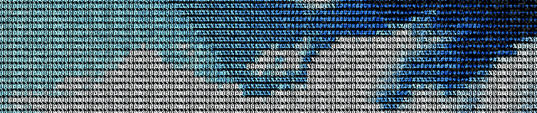
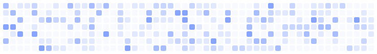

  

  # Hi, I'm Sofía 👋

  ### Full-stack Developer · Designer · UX/UI

  <em>Bringing ideas to life. Design-driven, code-powered.</em>

    

  
  
  

---

### 🌤️ About me

Graphic designer turned developer. I work at the intersection of **design and code** — building
digital products that are thoughtful in their UX/UI and solid under the hood. Currently working
**freelance, open to new opportunities**.

### 🛠️ Tech Stack & Tools

**Frontend & Design:**

**Backend & Databases:**

**Workflow & Environment:**

### ✨ Featured

- **[sofiacirioni.com](https://sofiacirioni.com)** — my portfolio, an Angular SPA with a custom
  ASCII animation engine, scroll-driven reveals and a bilingual (EN/ES) interface.

 

  <!-- Decorative element only (not real data): an ASCII-style grid where some cells twinkle like stars -->
  

  <!-- Contribution snake — real activity, celeste dots + blue snake.
       Para activarlo: pestaña Actions → "Generate Snake" → Run workflow (una vez).
       Cuando exista la rama `output`, descomentá este bloque:
  <picture>
    <source media="(prefers-color-scheme: dark)" srcset="https://raw.githubusercontent.com/sofiacirioni/sofiacirioni/output/snake-dark.svg">
    
  </picture>
  -->

